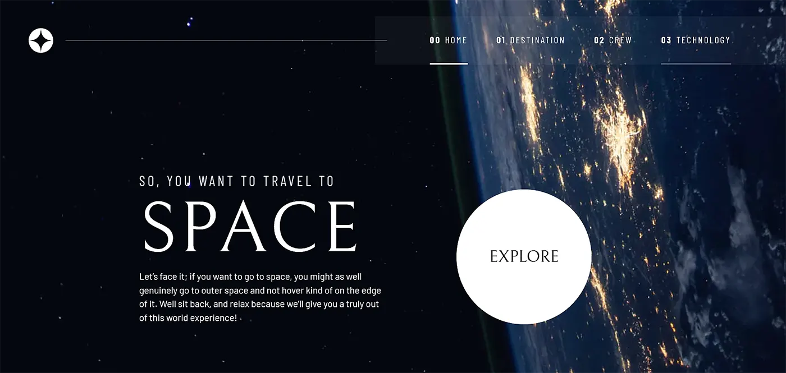

# Space tourism website build with Grid layout and Vanilla javascript



I used **Vanilla javascript** to change the content of the pages by fetching the data from the `json` local file
```js
eleId.textContent = jsonData[idField];
```

## Built with

- Semantic HTML5 markup
- CSS custom properties
- Flexbox
- CSS Grid
- Mobile-first workflow
- Accessibility workflow
- Vanilla Javascript